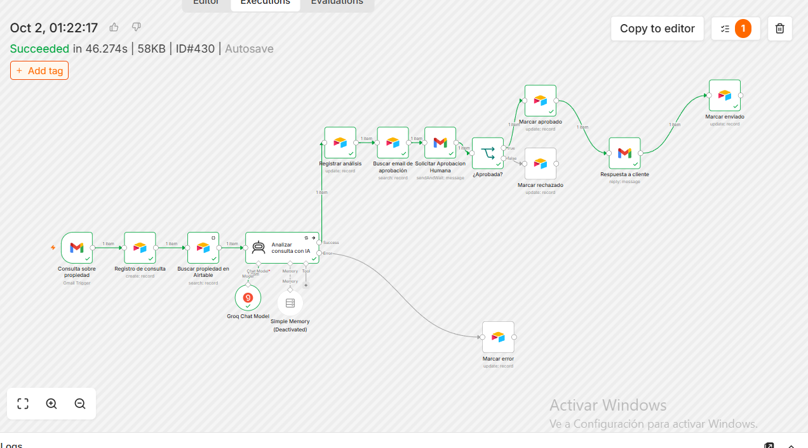
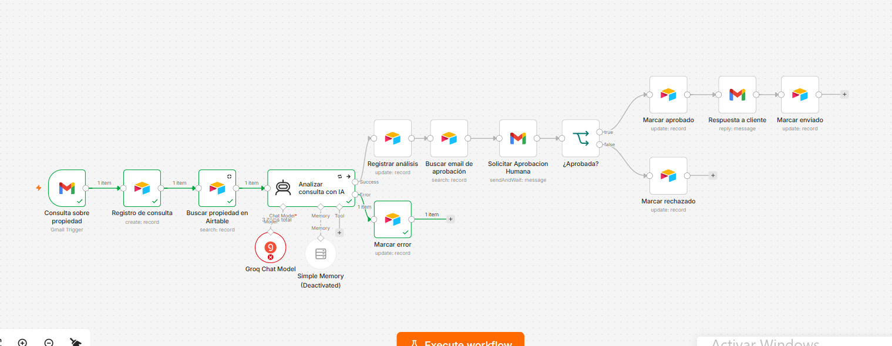
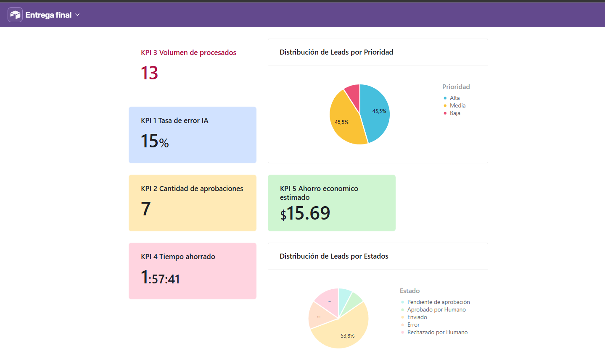

# Automatización de Leads Inmobiliarios con IA

Proyecto final de automatización desarrollado en **n8n** para gestionar consultas inmobiliarias recibidas por Gmail.

El sistema registra automáticamente cada consulta en Airtable, busca información de la propiedad, analiza el mensaje mediante inteligencia artificial y genera una respuesta propuesta.

Antes de enviar cualquier respuesta al cliente, el workflow incorpora una instancia obligatoria de **aprobación humana (Human-in-the-Loop)**.

---

## Tecnologías utilizadas

- n8n
- Gmail
- Airtable
- Groq
- GPT-OSS Safeguard 20B
- Human-in-the-Loop (HITL)

---

## Funcionamiento del workflow

El proceso principal es:

Gmail  
→ Registro del Lead en Airtable  
→ Búsqueda de propiedad  
→ Análisis mediante IA  
→ Registro del análisis  
→ Solicitud de aprobación humana  
→ Respuesta al cliente  
→ Actualización del estado

También existe una ruta alternativa para registrar errores producidos durante el procesamiento con IA.

---

## Base de datos

La base de Airtable está compuesta por tres tablas principales:

### Leads

Registra cada consulta y su evolución durante el proceso.

### Propiedades

Contiene la información comercial utilizada por la IA como contexto.

### Configuración

Almacena parámetros operativos del workflow, como el correo del responsable de aprobación.

---

## Seguridad y resiliencia

El sistema incorpora:

- Filtro anti-loop en Gmail.
- Procesamiento exclusivo de correos no leídos.
- Variables dinámicas.
- Thread ID de Gmail.
- Aprobación humana antes del envío.
- Ruta específica de error.
- Registro del detalle técnico del error.
- Reintentos automáticos del nodo de IA.
- Credenciales gestionadas mediante n8n.

---

## Dashboard

El Dashboard de Airtable permite visualizar los principales indicadores del sistema.

Resultados de la muestra final:

| KPI | Resultado |
|---|---:|
| Volumen de salida | 5 |
| Tasa de error IA | 14% |
| Tasa de aprobación | 83% |
| Tiempo ahorrado | 1:03:00 |
| Ahorro económico estimado | USD 8,40 |

---

## Evidencias

### Workflow aprobado

### Ruta de error

### Dashboard final

---

## Video demostrativo

El video muestra el funcionamiento completo del workflow en n8n, incluyendo el procesamiento del lead, análisis con IA, aprobación humana y actualización de estados.
La demostración completa del funcionamiento del workflow se encuentra en:

[Ver video demostrativo](Demo_Automatizacion_Inmobiliaria_n8n.mp4)

---

## Documentación completa

La documentación del proyecto incluye arquitectura, estructura de datos, JSON, seguridad, resiliencia, costos, pruebas y dashboard.

[Ver documentación final en PDF](Entrega_Final_Automatizacion_Inmobiliaria_2026.pdf)

---

## Workflow de n8n

El workflow completo puede descargarse e importarse en n8n desde el archivo JSON incluido en este repositorio.

`ENTREGA_8_Gestion_consultas_inmobiliaria_GitHub.json`

---

## Vistas públicas de Airtable

### Leads

https://airtable.com/appoLo3gLVfHx5iIF/shrwvJbGebLtuwAh3

### Propiedades

https://airtable.com/appoLo3gLVfHx5iIF/shrpfKFoCHG79JeRQ
